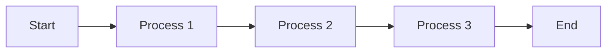

The theme is designed for people who want to write using the Markdown markup language.

Below is some information, but you can refer to the [Markdown Guide](https://www.markdownguide.org/) for a deeper understanding.

## Titles

### Syntax:

```markdown
# Title 1

## Title 2

### Title 3

#### Title 4

##### Title 5

###### Title 6
```

#### Exhibition:

# Title 1

## Title 2

### Title 3

#### Title 4

##### Title 5

###### Title 6

## Text styles

### Syntax:

```markdown
**Bold**
_Italic_
~~Scratched~~
```

#### Exhibition:

**Bold**

_Italic_

~~Scratched~~

## Check list

### Syntax:

```markdown
- [ ] Task 1
- [ ] Task 2
- [x] Task 3
```

#### Exhibition:

- [ ] Task 1
- [ ] Task 2
- [x] Task 3

## Lists

### Syntax:

```markdown
1. Item 1
2. Item 2

- Item
   - Subitem
```

#### Exhibition:

1. Item 1
2. Item 2

- Item
   - Subitem

## Links

### Syntax:

```markdown
[Link Text](https://myUrl.com)
```

#### Exhibition:

[Link Text](https://myUrl.com)

## Tables

To add captions to your tables, use the following markup just below the text that will serve as the caption for the table:

```bash
{: .caption-table}
```

```markdown
| Header 1 | Header 2 | Header 3 | Header 4 |
| :------: | :------: | :------: | :------: |
| Col1 | Col2 | Col2 | Col4 |
| L02 | L02 | L02 | L02 |

Table Legend
{: .caption-table}
```

#### Exhibition

| Header 1 | Header 2 | Header 3 | Header 4 |
| :------: | :------: | :------: | :------: |
| Col1 | Col2 | Col2 | Col4 |
| L02 | L02 | L02 | L02 |

Table Legend
{: .caption-table}

## Block Quote

For block quotes just start the text with `>`.

> Aliquid officiis incidunt eaque, necessitatibus explicabo velit veritatis fugit quaerat, corporis optio voluptates unde ipsum, expedita sunt quae.

## Bubbles

Bubbles are a way of emphasizing information, there are three types: _Tip_, _Observation_ and _Warning_.

```markdown
Information that can help make things easier.
{: .bubble-tip}

Information that may be useful and is important to know.
{: .bubble-note}

Information that needs attention to avoid a problem.
{: .bubble-warning}
```

To change bubble titles go to `assets/css/bubbles.css`.

#### Exhibition

Information that can help make things easier.
{: .bubble-tip}

Information that may be useful and is important to know.
{: .bubble-note}

Information that needs attention to avoid a problem.
{: .bubble-warning}

## Footnote

Create footnotes using the following syntax in square brackets:

```markdown
<!-- quotes -->

Click on the number to find the footnote[^1] and here is another footnote[^2].

<!-- references -->

[^1]: My first reference.
[^2]: My second reference.
```

#### Exhibition

Click on the number to find the footnote[^1] and here is another footnote[^2].

[^1]: My first reference.
[^2]: My second reference.

Regardless of where the footnote is placed, the rendering will always be at the bottom of the page.
{: .bubble-note}

## Codes

### Inline code:

To display code inline, within a paragraph, simply surround the text with backticks (``)

```markdown
The text with `inline code` block looks like this.
```

#### Inline display:

The text with `inline code` block looks like this.

### Code block:

To write a block of code, surround the content with three backticks, at the beginning and at the end.

By specifying the programming language at the beginning of the block after the three backticks the code will be styled.

````markdown
```python
num = int(input('Enter a value: '))
if num % 2 == 0:
print(f'0 value {num} is EVEN')
```
````

#### Block display:

```python
num = int(input('Enter a value: '))
if num % 2 == 0:
print(f'0 value {num} is EVEN')
```

## Image

To add images you have two options.

Images without captions can be added with basic Markdown syntax:

```markdown

```

#### Exhibition


To add **captions** to your images use the include `figure.html` as follows:



```liquid

```



#### Exhibition



## YouTube Videos

To add YouTube videos use the include `youtube.html` as follows:



```liquid

```



Replace the `id` value with the id of the video you want to embed.

#### Exhibition



## Mermaid Diagrams

It is possible to create diagrams and flowcharts easily and intuitively using the mermaid syntax. You can visit [official website](https://mermaid.js.org/intro/syntax-reference.html) to know the different ways of creating them.

````

````

#### Exhibition


## References